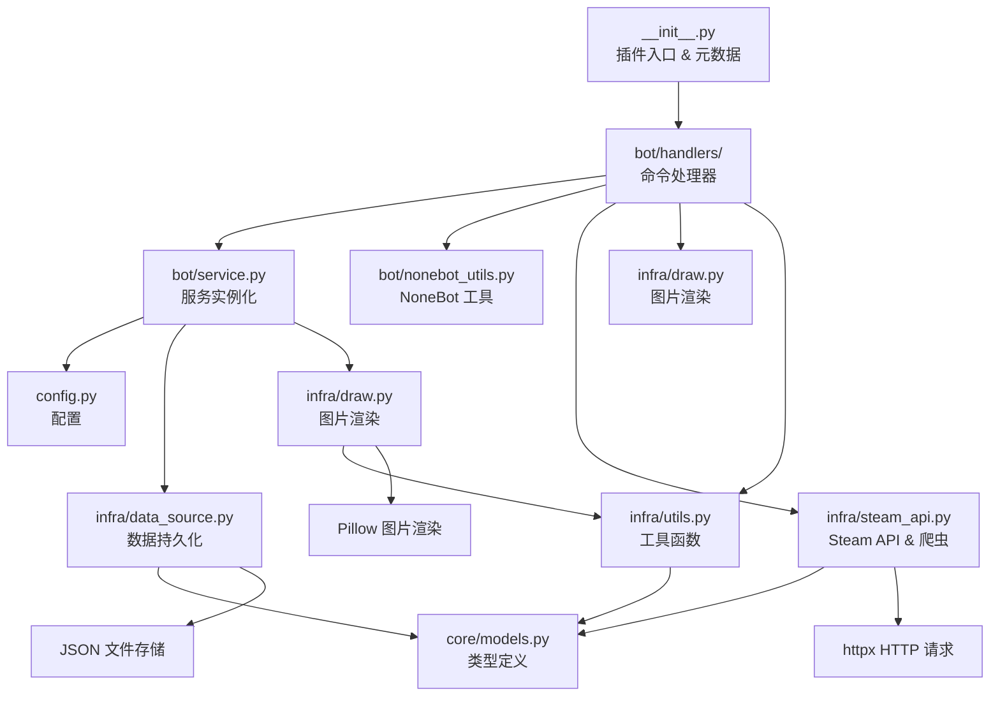
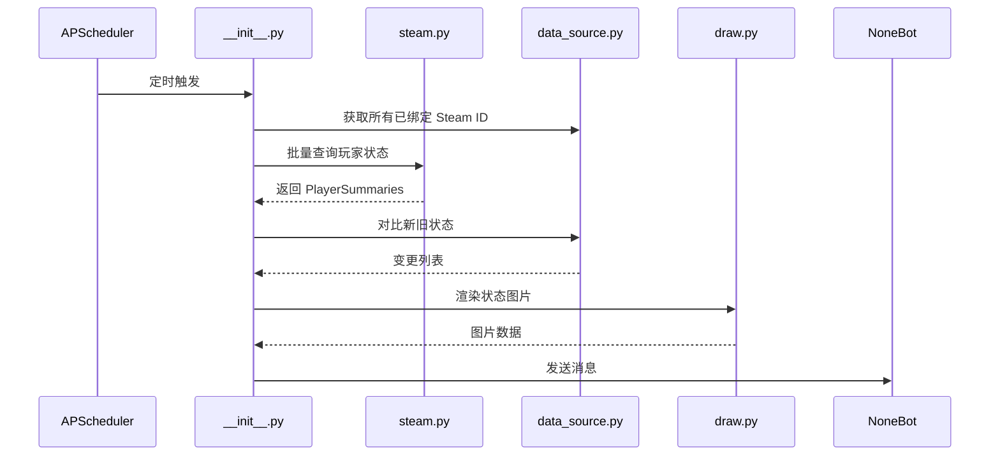

# System Patterns

## 系统架构

### 三层架构（参照 jmdownloader）
- **core/** — 领域模型层（无 NoneBot 依赖）：TypedDict 数据类型定义
- **infra/** — 基础设施层：Steam API 封装、数据持久化、图片渲染、工具函数
- **bot/** — Bot 交互层：服务实例化、NoneBot 工具函数、命令处理器（每个职责一个文件）

## 模块职责

### `__init__.py` - 插件入口
- 注册 PluginMetadata
- require() 依赖声明
- 导入 handlers 模块触发命令注册

### `bot/service.py` - 服务实例化
- 集中管理 config、数据路径、数据实例（bind_data, steam_info_data, parent_data, disable_parent_data）
- 字体配置与检查

### `bot/nonebot_utils.py` - NoneBot 工具
- `get_target()` - 消息目标获取
- `to_image_data()` - 图片数据转换

### `bot/handlers/` - 命令处理器
- 每个命令（或相关命令组）一个文件
- help.py, bind.py, info.py, check.py, broadcast.py, parent.py, nickname.py, scheduled.py
- `__init__.py` 统一导入注册所有 handler

### `config.py` - 配置定义
- 使用 Pydantic BaseModel 定义配置项
- 支持多 API Key（`steam_api_key` 可为字符串或列表）
- 配置验证器自动将单个 key 转为列表

### `infra/steam_api.py` - Steam 数据获取
- `get_steam_id()` - Steam ID 与好友代码转换
- `get_steam_users_info()` - 通过 Steam Web API 批量获取玩家信息（支持分批，每批 100 人）
- `get_user_data()` - 爬取 Steam 个人主页 HTML，解析游戏数据、头像、背景等
- `_fetch()` - 通用资源下载函数（带缓存）

### `infra/data_source.py` - 数据持久化
- `BindData` - 绑定数据管理（parent_id → user_id → steam_id 映射）
- `SteamInfoData` - Steam 玩家状态缓存（带游戏开始时间追踪）
- `ParentData` - 群信息管理（群名称和头像）
- `DisableParentData` - 禁用播报群管理

### `infra/draw.py` - 图片渲染
- `draw_friends_status()` - 渲染完整好友列表（仿 Steam 风格）
- `draw_start_gaming()` - 渲染开始游戏通知卡片
- `draw_player_status()` - 渲染个人主页
- 辅助函数：图片分割、渐变创建、颜色提取等

### `infra/utils.py` - 工具函数
- `fetch_avatar()` - 头像获取与缓存
- `simplize_steam_player_data()` - 简化玩家数据用于渲染
- `convert_player_name_to_nickname()` - 昵称替换
- `image_to_bytes()`、`hex_to_rgb()` 等辅助函数

### `core/models.py` - 类型定义
- 使用 TypedDict 定义各种数据结构
- `Player`、`ProcessedPlayer`、`PlayerData`、`DrawPlayerStatusData` 等

## 关键设计模式

### 数据存储模式
- 使用 JSON 文件持久化（通过 nonebot-plugin-localstore 管理路径）
- 每个数据类在 `__init__` 时加载，操作后调用 `save()` 写入
- 四个独立的 JSON 文件：`bind_data.json`、`steam_info.json`、`parent_data.json`、`disable_parent_data.json`

### 状态比较模式
- `SteamInfoData.compare()` 对比新旧玩家状态
- 产生四种事件类型：`start`（开始游戏）、`stop`（停止游戏）、`change`（切换游戏）、`error`
- `game_start_time` 字段追踪游戏开始时间

### 分层渲染模式
- 好友列表分三层：游戏中、在线好友、离线好友
- 各层独立渲染后垂直拼接（`vertically_concatenate_images`）
- 使用预设资源图片（`res/` 目录）作为模板

### API Key 轮换
- 支持多个 Steam API Key
- 遍历尝试，某个 key 失败则尝试下一个
- 超过 100 个 Steam ID 时自动分批请求

## 数据流

